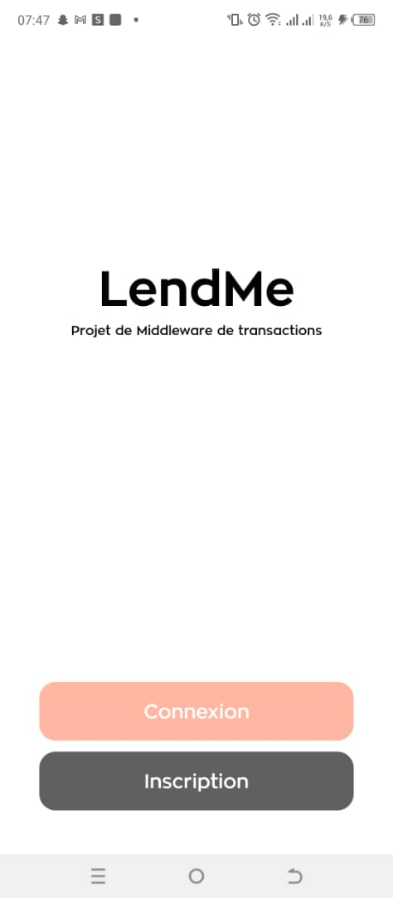
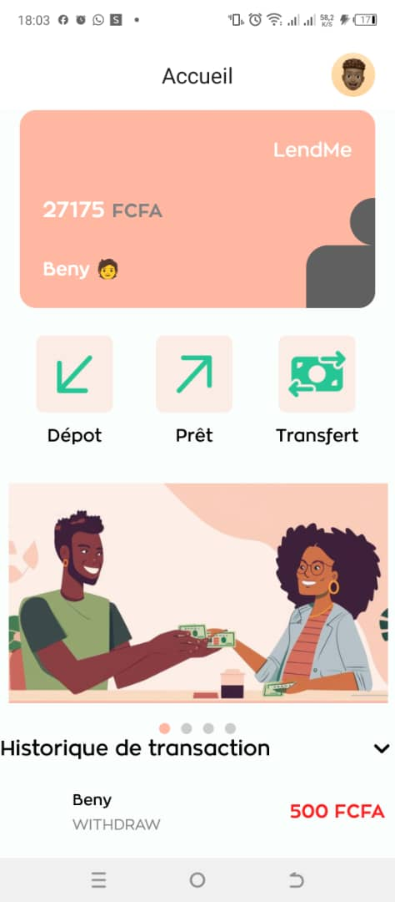
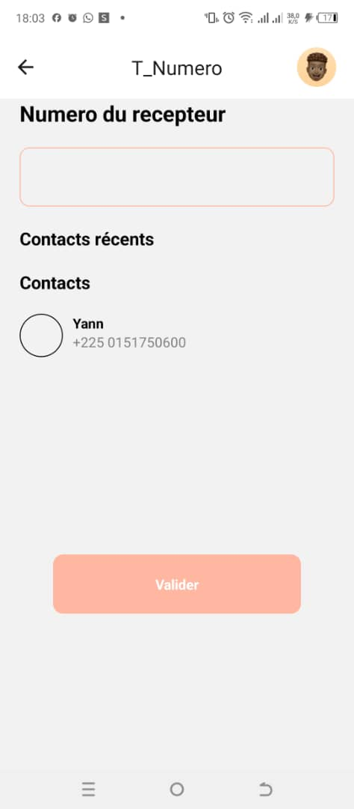
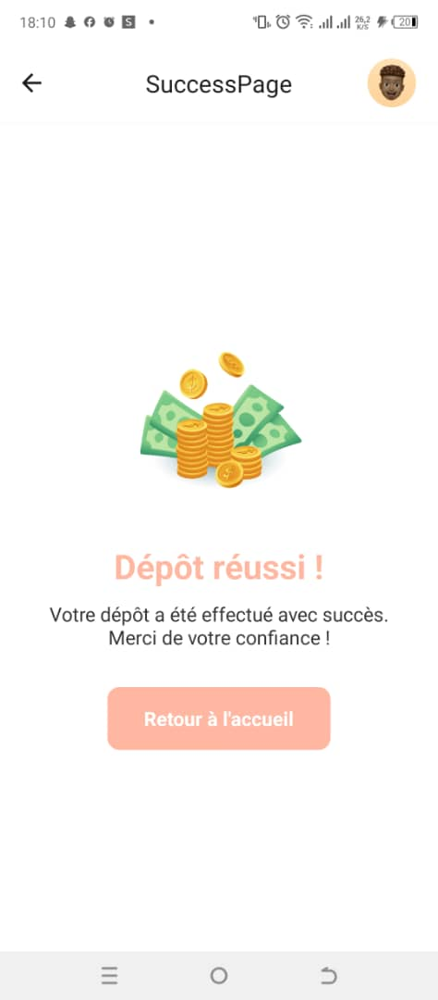
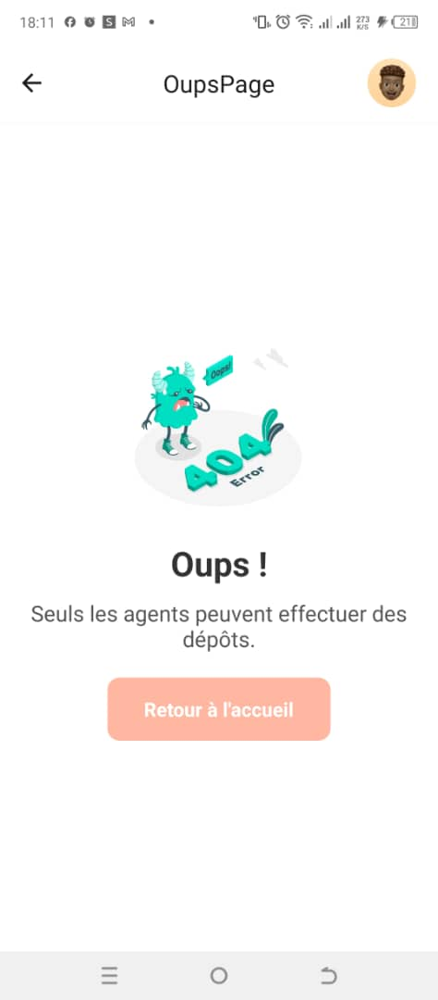
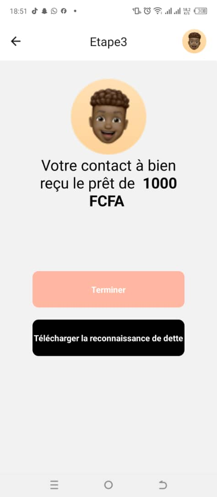

# LendMe

LendMe est un projet de classe conçu pour mettre en place une application de prêt et de transfert d'argent en utilisant un middleware. 
Ce projet utilise le **middleware de transaction JTA (Java Transaction API)** pour gérer les transactions de manière sécurisée et fiable.

## Prérequis

Avant de commencer, assurez-vous d'avoir installés :

- **WAMP Server** (ou un autre serveur local équivalent)
- **ORACLE JDK 23**
- **Node Js**
- **React Native**
- **Spring Boot**
- **MySQL Workbench 8.0 CE** : créez un schéma nommé `bd_transaction`
- **Expo CLI**
- **Expo Go** (pour les tests sur mobile)

## Installation

1. **Télécharger ou cloner le projet** :

   ```bash
   git clone https://github.com/Cypher1305/LendMe.git
   cd LendMe
   ```
2. **Installer les dependances** :

   ```npm install```

2. **Lancer l'interface mobile avec Expo** :
   - Accédez au dossier `lendme` :

     ```bash
     cd lendme
     npx expo start
     ```

   - Ouvrez l'application **Expo Go** sur votre mobile, puis scannez le code QR affiché dans la console.

3. **Configurer le backend** :
   - Dans une nouvelle fenêtre de votre éditeur de code, accédez au dossier backend :

     ```bash
     cd backend_transaction
     ```

   - Dans le **Spring Boot Dashboard**, exécutez l'application `backend-transaction_project` depuis le dossier `APPS`.

## Screenshots
Suivez les étapes ci-dessus pour démarrer l'application front-end avec Expo et le backend avec Spring Boot. 
L'interface mobile de LendMe vous permettra de tester les fonctionnalités de prêt et de transfert d'argent en temps réel.

<div style="display: flex; flex-wrap: wrap; justify-content: space-between;">
  <div style="margin: 10px; text-align: center; width: calc(33.33% - 5px);"> <!-- Largeur ajustée -->
    
    <p>L'écran de connexion de l'application.</p>
  </div>
  <div style="margin: 10px; text-align: center; width: calc(33.33% - 5px);"> <!-- Largeur ajustée -->
    
    <p>Interface d'accueil de l'application.</p>
  </div>
  <div style="margin: 10px; text-align: center; width: calc(33.33% - 5px);"> <!-- Largeur ajustée -->
    
    <p>Interface de transfert d'argent.</p>
  </div>
  <div style="margin: 10px; text-align: center; width: calc(33.33% - 5px);"> <!-- Largeur ajustée -->
    
    <p>Interface de dépôt d'argent (réussi).</p>
  </div>
  <div style="margin: 10px; text-align: center; width: calc(33.33% - 5px);"> <!-- Largeur ajustée -->
    
    <p>Interface de dépôt (erreur).</p>
  </div>
  <div style="margin: 10px; text-align: center; width: calc(33.33% - 5px);"> <!-- Largeur ajustée -->
    
    <p>Interface de prêt d'argent (réussi).</p>
  </div>
</div>


